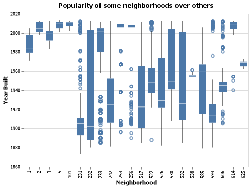
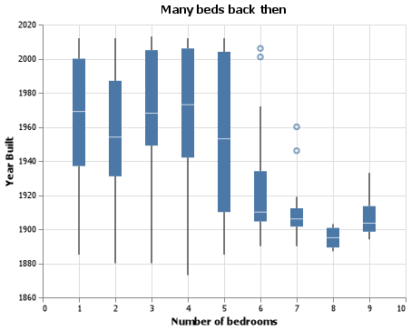
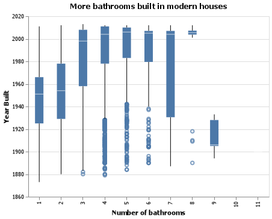

# Spirit2_Data_Analysis# Overview

### Task: Creating charts by using Data Visualization to solve two questions.  

### Purpose: I make this project by creating charts and use machine learning model to explain

[Software Demo Video](http://youtube.link.goes.here)

# Data Analysis Results

### GRAND QUESTION 1:Create 2-3 charts that evaluate potential relationships between the house variables and the variable before1980 Explain what you learn from the charts that could help a machine learning algorithm.

I learned from the first chart about the neighborhood code 242 and 517 had older houses than others
before 1980.
I also learned from the second chart about those houses built before 1980 has more bedrooms.

### GRAND QUESTION 2: Build a classification model labeling houses as being built “before 1980” or “during or after 1980”. Your goal is to reach 90% accuracy. Explain your final model choice (algorithm, tuning parameters, etc) and describe what other models you tried.

In my assumption, I found out that there are more bathrooms built in modern house after 1980, and
the accuracy is about 90%.
Here is my chart to prove that:

# Development Environment

### Appendix A
#### This is where your python script will go. Your code should be commented and well organized.
#%%
import pandas as pd
import altair as alt
import numpy as np
#import catboost as cb
from catboost import CatBoostClassifier, CatBoostRegressor
from sklearn.model_selection import train_test_split
from sklearn import tree
from sklearn.naive_bayes import GaussianNB
from sklearn import metrics
from altair_saver import save
from sklearn.ensemble import GradientBoostingClassifier
from sklearn.ensemble import RandomForestClassifier
from sklearn.datasets import make_classification
from sklearn.metrics import accuracy_score, recall_score, precision_score
alt.data_transformers.enable('json')
#%%
#Import data
dwellings_denver = pd.read_csv("https://github.com/byuidatascience/data4dwellings/raw/master/dat
dwellings_ml = pd.read_csv("https://github.com/byuidatascience/data4dwellings/raw/master/data-ra
dwellings_neighborhoods_ml = pd.read_csv("https://github.com/byuidatascience/data4dwellings/raw/
#%%
#Split data
#X, y = load_iris(return_X_y=True)
X = dwellings_ml.drop(['before1980', 'yrbuilt','parcel'], axis = 1 )
y = dwellings_ml.filter(regex = 'before1980')
#X_train, X_test, y_train, y_test = train_test_split(X, y, test_size=0.3, random_state=76)
X_train, X_test, y_train, y_test = train_test_split(X, y, test_size=0.34, random_state=76)
p = y_test.head(10).mean()
print(p)
#%%
#Stories
#Sales price
#Square footage
#Garage size
#Bathrooms
chart1 = (alt.Chart(dwellings_denver.query('yrbuilt > 0 and numbdrm > 0'))
.encode(
alt.X('numbdrm', title = "Number of bedrooms"),
alt.Y('yrbuilt', scale = alt.Scale(zero = False), title = "Year Built", axis = alt.Axis(
.mark_boxplot()
.properties(
width = 400,
title = {
"text": "Many beds back then"
}
)
)
chart1.save('chart1.png')
chart1
%%
chart2 = (alt.Chart(dwellings_denver.query('yrbuilt > 0 and numbaths > 0'))
.encode(
alt.X('numbaths:O', scale = alt.Scale(zero = False), title = "Number of bathrooms"),
alt.Y('yrbuilt', scale = alt.Scale(zero = False), title = "Year Built", axis = alt.Axis(
)
.mark_boxplot()
.properties(
width = 400,
title = {"text": "More bathrooms built in modern houses"
}
)
)
chart2.save('chart2.png')
chart2

### Stretch Challenges (select one):

* Update your software so it draws a graph showing some of the results.

# Useful Websites

{Make a list of websites that you found helpful in this project}
* [Data Science—Wikipedia ](https://en.wikipedia.org/wiki/Data_science)
* [Overview of Pandas ](https://pandas.pydata.org/docs/getting_started/overview.html)

# Future Work

{Make a list of things that you need to fix, improve, and add in the future.}
* Identify a third question from your dataset and write code to answer it.
* Create a Web App for this data visualization. 
* Import datasets from a furniture website to track from the past until now. 
